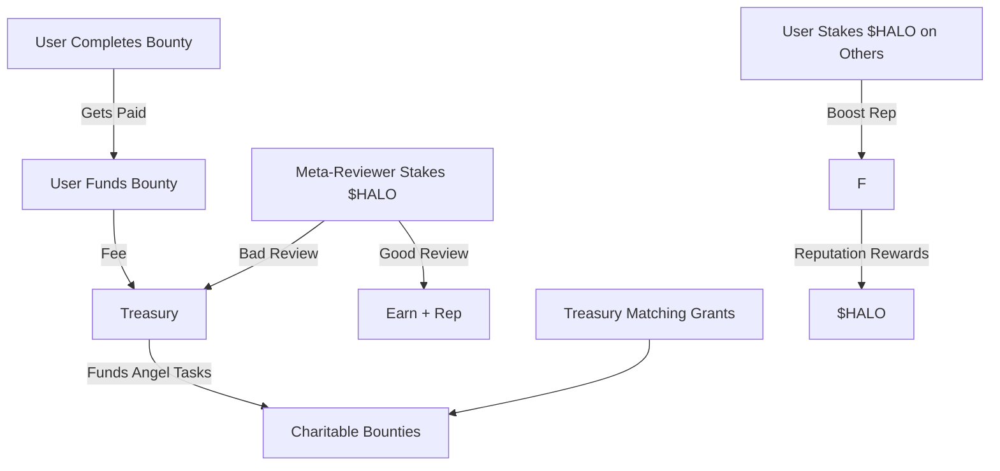

# Planning phase -- alpha-taskangel
initial prototype of taskangel, a self-administrating decentralized task completion platform with integrated charitable works 

## Initiative Planning
UX: Initiative Owner
End user who starts the initiative, it would look like: 
- have an idea, create an "initiative"
- wait for admin to create initial plan.
- look and approve plan: check admin's initial plan and say "this looks good. go ahead with this"
- look and approve tasks: check admins "work bounty" tasks/definitions/estimated costs
- deposit bounty funds
- approve and finalize: initiative is completed

UX: Administrator
from admin perspective: 
- browse list of new initiatives. 
- find one that seems cool, and has a reputable sounding founder, and maybe some initial locked funding for the initiative. 
- throw my hat into the ring to take lead admin role. algorithm will pick me based on reputation and skill match. 
- i do initial planning, and i get paid out for doing the work. 
- if original creator likes the plan, i get a little contract to do the next phase. initial payment to start maybe and another payment

Notes:
- Locked small features encouraged, compose many tasks together.
- Initial dispute resolution would escalate to me. build a system once we know what types of disputes typically arise.
- Administrators are initially suggested by algorithm until reputation systems go.
- Requested feature metrics:
  - Speed: Admin feedback within 24h, task delivery within agreed window.
  - Clarity: Task scopes are written clearly and concisely with my nod of approval.
  - Trust: Funds are safu, and arbitration is neutral.
  - Accountability: Clear metrics on task failure/success and user ratings.
  - Flexibility: I can revise or pivot the initiative easily with relatively little friction if it's reasonable.

Later features: 
- meta-tasks and sub-tasks
- more discussion-style back and forth between owner/admin
- dispute resolution if there's a conflict on satisfactory completion of tasks, or of planning. Initially escalate to me, but later bring it to community verifier/validator/arbitrators. 
- Call for "Expert Contribution" to bring in subject matter experts

User Story Initiatives: 
1. if I had stock footagte and copy, having someone make Instagram ads for my gym.
2. finding suppliers for apparel and comparing prices, MOQs etc
3. simple tasks like tax/forms/registrations, etc that have to be done in my non-native language? If not doing them, finding out what needs to be done, and in what order.
4. localization
5. cold calling leads (maybe record the calls > transcription > maybe sentiment analysis/sales analysis)
6. scraping emails/telephone numbers from X source


# PRIOR SECTION
## 🗓️ Trello Clone: Initial Development Plan
### Tech Stack
- Frontend: Next.js (App Router) + TailwindCSS

- Backend: Next.js API Routes or Server Actions

- Database: PostgreSQL (AWS RDS)

- Auth: Auth.js (PostgreSQL Adapter)

- CI/CD: Docker + GitHub Actions + AWS Elastic Beanstalk

- ORM: Prisma

### 📅 Phase 1 – Initial Setup & Infrastructure
- Create AWS RDS PostgreSQL instance

- Set up Dockerized Postgres instance

- Scaffold Next.js project

- Install TailwindCSS, Prisma

- Configure .env with postgres

- Set up initial Prisma schema with:
 - User, Account, Session (Auth.js required tables)

✅ Deliverable: App running locally and connected to Dockerized PostgreSQL
#### Phase 1 Status: **Completed** on 6/11/25

### 📅 Phase 2 – Auth Integration (Auth.js)
- Install and configure auth.js

- Use PostgreSQL adapter with JWT sessions

- Enable credentials provider (or add Google/GitHub)

- Secure routes and add login/signup UI

- (Deferred to after boards created) On first login, auto-generate a “Personal Tasks” board 

✅ Deliverable: Functional authentication + default board on login
#### Phase 2 Status: Completed on 6/12

### 📅 Phase 3 – Dockerize & CI/CD Pipeline
#### Phase 3 Status: In Progress.
- Write Dockerfile for multi-stage Next.js build

- Create .dockerignore

- Configure GitHub Actions workflow:

- Build Docker image

- Push to Elastic Beanstalk via AWS CLI or EB CLI

- Run migrations before deploy (optional)

 - Test full deployment from GitHub to AWS

✅ Deliverable: CI/CD pipeline deploys app to AWS EB on main push


### 📅 Phase 4 – Boards, Columns, and Cards
- Define models: Board, Column, Card

- Build a basic Kanban board view

- Allow adding, editing, deleting cards

- Implement drag-and-drop using dnd-kit

- Persist changes in the database

✅ Deliverable: Fully working personal task board with DnD functionality

### 📅 Phase 5 – Idea Capture + Auto Task Generation
- Add floating idea capture button or command palette

- Form inputs: title, notes, tags

- On submission:

- Store idea in DB

- Auto-generate a task on "To Do" column of personal board

- Confirm with toast or visual feedback

✅ Deliverable: Idea capture feature that turns ideas into actionable tasks

### 📅 Phase 6 – UI Polish & Mobile Layout
- Improve layout, spacing, hover/empty states

- Make board responsive for mobile

- Add icons, animations, labels, optional tags

- Polish drag behavior on touch devices

✅ Deliverable: Clean, responsive UI with intuitive task management

### 📅 Phase 7 – Finalize Deployment & QA
- Final testing of the entire flow (login → board → task → idea)

- Set up error logging (Sentry, CloudWatch, etc.)

- Optimize build and image size

- Update documentation and README

- Confirm CI pipeline is production-ready

✅ Deliverable: Fully deployed Trello clone with CI/CD and production readiness

# Project Features 
## 🌱 Ongoing Bounties & Concept Branching
### 🔄 What Are Ongoing Bounties?
An Ongoing Bounty is a bounty with a persistent or cumulative reward pool that:

Encourages multiple submissions or continuous improvement

Accepts refinements, optimizations, or variants of a core task

May never fully close, but rewards iterative contributions over time

### 💡 Use Cases:
Improving an open-source tool incrementally

Refining a research summary over several contributors

Generating a library of educational material

Expanding on a public dataset

### 🌿 What Are Branchable Tasks?
Branchable Tasks allow users to fork an existing task or bounty, using it as the seed for:

A new idea, variant, or use-case

A related tool or asset

A chain of progressive enhancements

Each branch can be turned into its own new bounty—with its own backers or tied to the treasury.

### 🔁 How Ongoing Bounties Work in TaskAngel
Poster creates a bounty and marks it as Ongoing (toggle or tag)

A fund pool (e.g. $500) is locked into it

Contributors submit iterations over time

Each submission is peer-reviewed via meta-tasks, and:

A portion of the pool is awarded (e.g., $50 per accepted improvement)

Poster (or governance group) can boost the bounty if value is being created

If the pool runs out:

Poster can refill it

Treasury or other backers can top it up

Or it can close gracefully

### 🌱 How Branching Works
Any task can be forked with a single click: “Branch This Task”

The brancher:

Writes a new task with clear relation to the original

May inherit some acceptance criteria or remix it

Can link back to original in the bounty description

Branch tasks can:

Pull from the same treasury pool (if marked as Angel-related)

Inherit visibility in a shared thread/feed

Get bonus reward weight from governance for ecosystem growth

### 💰 Integration with Treasury & Meta-System
Component	Interaction
Ongoing Bounties	Treasury can fund long-running public goods bounties (e.g., "Improve the climate policy dataset")
Branching	Allows for decentralized idea evolution, incentivized through micro-bounties and peer validation
Meta-bounties	Still govern all verification, moderation, QA tasks around both new and improved submissions
Slashing	Still applies to dishonest meta-task verifiers or reviewers
Staking	Optional for those improving on high-value Ongoing Bounties (to prevent spam/fork flooding)

## 🧠 Example Workflow: Branchable + Ongoing
Task: "Build a browser plugin that blocks hate speech"

Marked as Ongoing, funded with $400 pool

User A submits v1 → gets $100

User B submits a multilingual version → gets $75

User C forks the bounty: "Adapt this plugin for YouTube comment filters"

New task, accepted as valid branch

Funded by $100 from treasury + $50 from new backers

Meta-bounty created to verify this branch relationship

Staked, peer-reviewed

Verified as legitimate expansion

### ✨ Benefits of This Model
Benefit	How It Delivers
🌱 Ongoing Innovation	Encourages continuous iteration, not just one-and-done
🧬 Ecosystem Growth	Branching builds interconnected layers of bounties
🎯 Targeted Use of Treasury	Treasury funds don’t go to dead-end tasks but fund living ones
💡 Empowered Hunters	Hunters can become initiators, not just doers
🔍 Better Discoverability	Users can browse task trees, not just isolated bounties


## Activity tracking + value-based history logging into TaskAngel, in a way that’s lightweight now but becomes powerful later.

### 🧭 Why Track Activity?
Tracking actions of value gives you the raw data needed to build:

A reputation system (trust, consistency, quality)

Leaderboards (top funders, top hunters, best meta-reviewers)

Platform analytics (conversion, engagement, user quality)

Community rewards (retroactive airdrops, badges, ranks)

Sybil resistance (by proving ongoing good-faith effort)

### 🧱 What Should Be Logged?
Here's a breakdown of trackable user actions, categorized by user role and impact level:

#### 🧑‍💼 Posters
Action	Data to Store
Created bounty	Bounty ID, criteria hash, funding amount, timestamp
Funded treasury	Amount, purpose, timestamp
Refueled ongoing bounty	Bounty ID, amount, timestamp
Approved/declined submissions	Bounty ID, submission ID, action, timestamp
Created Angel Proposal	Proposal ID, description hash, votes, outcome

#### 🧑‍🔧 Hunters
Action	Data to Store
Claimed a task	Bounty ID, timestamp
Submitted solution	Submission ID, bounty ID, size/complexity tag
Earned payout	Bounty ID, amount, timestamp
Took a meta-task	Meta-task ID, stake amount
Got stake slashed or returned	Task ID, reason, timestamp
Branched a bounty	Origin ID, new bounty ID, timestamp

#### 🤖 Platform / System
Action	Data to Store
Treasury-funded bounty	Bounty ID, treasury grant amount
Slashing event	User ID, amount, task ID, reason
Reputation adjustment (future)	Trigger type, old value, new value

💾 Database Schema Recommendation (Modular + Future-Ready)
```sql
Copy
Edit
-- Users Table
users (
    id UUID PRIMARY KEY,
    username TEXT,
    wallet_address TEXT,
    created_at TIMESTAMP
)

-- Action Logs (generic activity feed)
user_activity_logs (
    id UUID PRIMARY KEY,
    user_id UUID REFERENCES users(id),
    action_type TEXT,
    action_details JSONB,
    value_weight INTEGER,
    created_at TIMESTAMP
)

-- Bounties
bounties (
    id UUID PRIMARY KEY,
    creator_id UUID REFERENCES users(id),
    status TEXT,
    reward_pool BIGINT,
    is_ongoing BOOLEAN,
    is_angel BOOLEAN,
    acceptance_criteria TEXT,
    created_at TIMESTAMP
)

-- Submissions
submissions (
    id UUID PRIMARY KEY,
    bounty_id UUID REFERENCES bounties(id),
    submitter_id UUID REFERENCES users(id),
    status TEXT,
    reviewer_id UUID,
    stake BIGINT,
    created_at TIMESTAMP
)

-- Treasury
treasury_events (
    id UUID PRIMARY KEY,
    user_id UUID REFERENCES users(id),
    action TEXT, -- fund, grant, slash, etc.
    amount BIGINT,
    target_id UUID, -- bounty or proposal
    timestamp TIMESTAMP
)
```

### 🔢 Tracking “Value Score” for Each Action
To prepare for future reputation weighting, each action can have an optional value_weight attached based on:

Amount of funding moved

Complexity of task

Approval rate

Peer reviews

On-chain transaction gas (optional: don't have to show this score to users now—just record and store it quietly)

## 🔮 Reputation System Later (Preview)
You could eventually calculate a Reputation Score for each user as a weighted sum of:

```
= (Funds Posted * 0.3)
+ (Angel Tasks Proposed * 0.2)
+ (Bounties Completed * 0.3)
+ (Meta Tasks Successfully Verified * 0.1)
- (Tasks Rejected or Slashed * 0.1)
```

You could also assign roles later like:

🏆 Angel Patron (top 1% funders)

🔍 Guardian (high-quality meta-reviewer)

🚀 Pathfinder (frequent branchers/innovators)


## 🪙 Token Name: $HALO
The $HALO token is the native utility + governance token of TaskAngel.

🧬 Token Roles
Use Case	Role of $HALO
Governance	Vote on treasury use, protocol upgrades, reputation criteria
Staking	Required for meta-bounty reviewers & branching/curation challenges
Reputation Backing	Staked $HALO can amplify or signal trust in other users
Fee Discounts	Pay platform fees in $HALO to get a discount
Charitable Matching	Treasury can match user-donated $HALO for Angel tasks
Incentives	Distributed as retroactive rewards to high-rep contributors
Slashing Sink	Slashed meta-task stakes are burned or redirected to the treasury

💸 Token Allocation (Example)
Category	Allocation	Notes
Ecosystem Fund	35%	Treasury, charitable bounty pool matching, grants
Core Team & Devs	20%	With long-term vesting
Community Rewards	20%	Hunters, posters, meta-verifiers, early users
Investors	15%	Strategic only, ideally with contribution lockups
DAO Reserve	10%	Emergency usage, protocol upgrades

⚖️ Token Utility Flow
🧑‍🔧 Bounty Hunter Flow:
Completes bounties → Earns USDC or $HALO (or both)

Stakes $HALO to participate in high-rep meta-tasks

Can boost rep score by staking $HALO behind own identity

🧑‍💼 Poster Flow:
Funds bounty in USDC, optionally boosts with $HALO

Pays platform fee—can pay in $HALO for discount

Can propose treasury grants for Angel tasks (requires $HALO stake)

👥 Reviewer/Verifier Flow:
Takes meta-tasks

Stakes $HALO → gets slashed for poor moderation

Earns $HALO/USDC for accurate verification

🔐 Staking & Slashing
Meta-task participants must stake $HALO

Disincentivizes lazy or fraudulent moderation

Slashing events add deflationary pressure or bolster treasury

Reputation-backed Bounties

Optionally allow users to vouch for a task with staked $HALO

If task is fraudulently created or fails moderation, slashing applies

📈 Reputation System: Token + History Based
Reputation ≠ token balance, but $HALO is still a signal.

Reputation is earned via:

Verified bounty completions

Accepted meta-reviews

Funding Angel/charitable tasks

$HALO stake can amplify reputation credibility ("skin in the game")

Reputation boosts earn retroactive $HALO drops from treasury

### 🧮 Token Economic Model: Sustainability Loop 
(broken - fix this later)


🔄 Optional Token Enhancements
Feature	Description
Quadratic Voting	Treasury votes weighted by square root of $HALO held, not linear
Burn Mechanism	% of slashed tokens are permanently burned
Yield Utility	Treasury deposits $HALO into DeFi protocols to generate stablecoin yield
Retroactive Public Goods Funding	High-impact contributors rewarded from reserve pool via vote


## 🌐 TaskAngel Sitemap
🏠 1. Homepage
URL: /

Content:

Hero banner: “Bounties with Purpose”

CTA buttons: [Post a Task], [Find Bounties], [View Angel Tasks]

Quick search bar (by tag, keyword)

Featured Bounties (Trending, High Rewards, Angel Tasks)

Top Hunters this week

Treasury Stats: Total Funds, Angel Grants Given

No data changing here. Mostly dynamic content pulled from the backend.

🔍 2. Explore Bounties
URL: /bounties
Filters: Tags, Category, Ongoing Only, Angel Tasks, Funding Size, Newest

Displayed Data:

List of all bounties

Each card shows:

Title, tags, reward size

Bounty creator, deadline

Status (Open, Ongoing, Closed, etc.)

✅ Pulls from: bounties table
❌ No direct data changes on this page

📄 3. Bounty Detail Page 🔧
URL: /bounty/:id

Content:

Title, Description, Tags, Deadline, Reward

Acceptance Criteria (strict guidelines)

Bounty Type (Regular, Ongoing, Angel)

Submission List (if any)

Meta-bounty tasks (pending, open, closed)

Treasury Source (e.g. “Partially funded by Angel Pool”)

Data-Changing Actions:

Submit Work (if you're a bounty hunter)

Add Comments / Ask Questions

Submit a Branch Task 🔧

Stake to Create Meta Task 🔧

Poster can:

Edit bounty (while open) 🔧

Fund or increase bounty 🔧

Accept / reject submissions 🔧

🧾 4. Submit Work Page 🔧
URL: /bounty/:id/submit

Form Fields:

Link to work

Optional notes

Upload files

Acceptance checklist auto-filled from bounty

Action:

Creates a new submission entry

✅ Updates: submissions table, links to bounty id
🔧 Data Change: Yes (new submission created)

🕵️‍♀️ 5. Meta Task Dashboard 🔧
URL: /meta

Content:

List of open meta-bounties needing review

Each includes:

Task name, required stake, estimated difficulty

Link to submission being evaluated

Sort by staked amount or urgency

Actionable Items:

Stake $HALO to accept a meta-task 🔧

Submit verdict & justification 🔧

✅ Updates:

meta_tasks, user_activity_logs, and possibly treasury_events (if slashed)

👤 6. User Profile Page 🔧
URL: /user/:id

Data Sections:

Public Name, Reputation Score

Wallet Address, Join Date

Tasks Posted

Tasks Completed

Stake History

Treasury Contributions

Badges (coming soon)

🔧 Data Changing Options (for the user themselves):

Change display name / bio

Link/Unlink wallet

🧰 7. Post Bounty Page 🔧
URL: /bounties/new

Form Fields:

Title, Description, Tags

Reward amount

Deadline, Type (Ongoing / Angel / Meta)

Strict Acceptance Criteria

Optional Staking Required

Optional Public Forking Allowed

✅ Creates: bounties table entry
🔧 Major Data Changing Page

🌿 8. Branch Bounty Page 🔧
URL: /bounty/:id/branch

Form Fields:

New title, description

Link to original bounty auto-populated

Unique criteria for this branch

New reward pool or "inherited"

✅ Creates: New bounty entry, with parent_bounty_id field
🔧 Data Changing Page

💸 9. Treasury Dashboard 🔧
URL: /treasury

Sections:

Total Treasury Balance (USDC + $HALO)

Angel Tasks Funded

Treasury Events Log (grants, slashes, deposits)

Proposal List

Admin Actions (or DAO in future):

Approve Angel Grants 🔧

Slash Bad Actors (on consensus) 🔧

Match Bounty with Treasury Funds 🔧

✅ Updates: treasury_events, bounties, angel_grants

📈 10. Reputation Explorer
URL: /reputation

Content:

Top Hunters

Top Meta-Verifiers

Top Donors

Reputation Calculation Model (transparent)

Reputation Over Time Graph (per user or system-wide)

❌ No direct data changes
✅ Pulled from: user_activity_logs, submissions, meta_tasks

🧭 11. Angel Task Explorer
URL: /angel

Content:

Highlighted Charitable or Open Public Good Bounties

Source of funds (e.g. "Fully funded by treasury")

Tags: Health, Education, Environment, Accessibility

✅ Mostly same structure as bounty explorer
❌ No direct data-changing actions unless submitting

🗳️ 12. Governance & Proposals Page 🔧 (Future)
URL: /governance

Content:

Active/Passed/Failed Proposals

Vote history

Proposal creator

Proposal content hash

Actionable:

Submit New Proposal 🔧

Stake $HALO for proposal support 🔧

Vote on Proposal (Quadratic/Linear) 🔧

### ✅ Pages That Change Data (Summary)
Page	Type of Data Changed
Bounty Detail Page	Bounty edits, fund updates, submission acceptance
Submit Work Page	New submission
Meta Task Dashboard	Review outcomes, stakes
User Profile	Personal info (self only)
Post Bounty Page	New bounty
Branch Bounty Page	New bounty with parent
Treasury Dashboard	Funding approvals, slashing
Governance Page	Proposals, votes (future)
